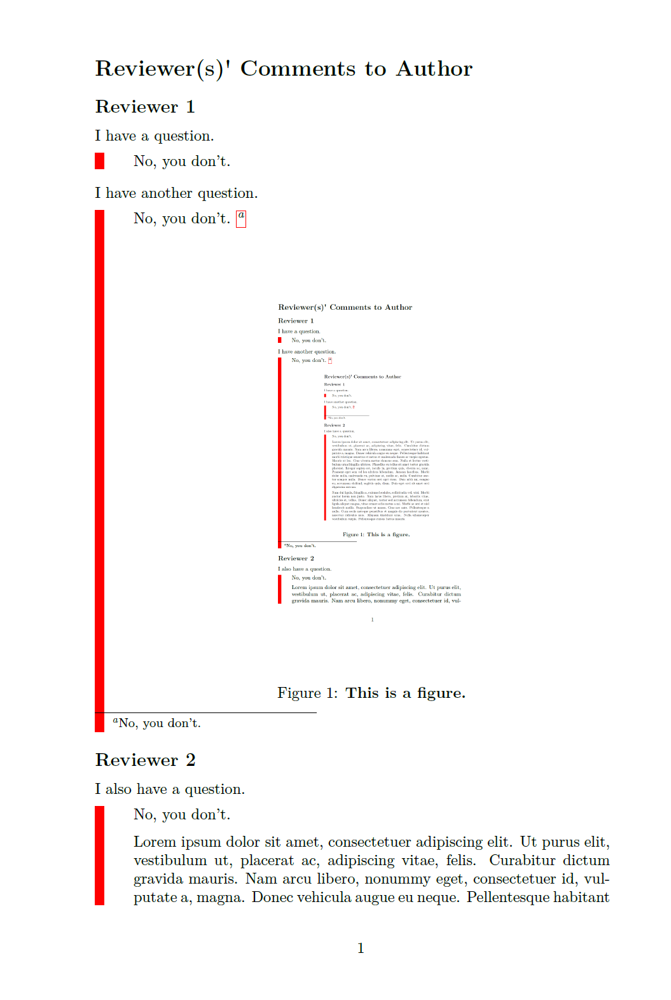

<div align="center">

#  STD

_✨ a Simple latex Template for replying to the reviewer's Doubts ✨_

</div>

<p align="center">
  <a href="https://github.com/SukiYume/STD">
    
  </a>
  <a href="https://github.com/SukiYume/STD/stargazers">
    
  </a>
</p>

## Description

This is a very very simple LaTeX template designed to facilitate the process of replying to reviewer comments for academic papers. Previously, I often used `Word` to address review comments, which made collaboration and version control less convenient. Hence, this project was born. 

> However, it is genuinely a very straightforward, or even somewhat useless, project. Lately, I've been tormented by review comments, so I thought of sharing this LaTeX template.

## Usage

Users can easily copy the content of `simple_template.tex` into `Overleaf` to start the document. In this template, a simple `tcolorbox` environment is customized to distinguish between questions and replies. A simple Q&A example is provided below:

```latex
I have a question.
\begin{reply}
No, you don't.
\end{reply}
```

If you need to insert a figure in your response, you can use the following code within the reply block:

```latex
\begin{center}
  \includegraphics[width=0.5\textwidth]{figure.png}
  \captionof{figure}{\bf This is a figure.}
  \label{fig:1}
\end{center}
```

If a response becomes too lengthy, it will automatically paginate. The figure below is an example of the first page generated in the PDF.

<div align="center"></div>

## Contributing

If you find issues or have suggestions for improvements, feel free to open an issue or create a pull request. Contributions are welcome!

## License

This project is licensed under the [MIT License](LICENSE).